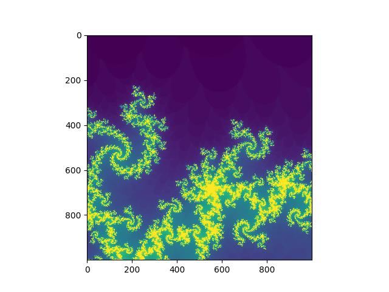

#### Mandelbrot benchamrk

Naive implementation of mendelbrot calculation with different programming languages.

What is the Mandelbrot set?
The Mandelbrot set consists of all (complex numbers) c that satisfy a certain condition: a complex number c such that the trajectory produced by iterating through x² + c starting from an initial value of 0 does not go to infinity.

#### Usage of benchmark

Edit `config.yaml` to decide which languages you would like to benchmark.

Edit `makefile` and `benchmark.py` to customize your toolchains which suit for `Linux` by default. 

```shell
${python} benchmark.py
```

#### Usage of  each scripts

```shell
${run command} ${xmin} ${xmax} ${ymin} ${ymax} ${width} ${height} ${maxiter}
```

example:

```shell
python mandelbrot.py -0.22 -0.219 -0.70 -0.699 100 100 124
```
<div align="center">

<br>
Rendered by function test() in mandelbrot.py
</div>

#### Todo list

##### Languages

- [x] C/C++
- [x] Rust
- [x] Python
- [x] Java
- [x] Javascript
- [x] Go

##### Environment

- [ ] github action
- [ ] docker